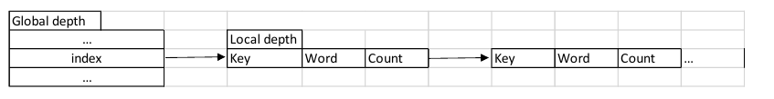
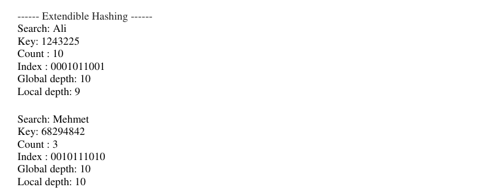

# Extendible Hashing
Assume that the hash code function hc(key) returns a string of bits. The last i bits of each string
will be used as indices to figure out where they will go in the "directory" (hash table).
Additionally, i is the smallest number such that the index of every item in the table is unique.

### The Hash table should look like as below:

### Assumed standard output of our program appear as follows:

## Main Functionalities:
**INSERT**: Read the given input file, calculate the number of occurrence of each word, insert
this information into the hash table accordingly.
**SEARCH**: Search a user input (word) in the hash table. If the input is available in the table
return an output as shown above, otherwise return a “not found” message to the user.
